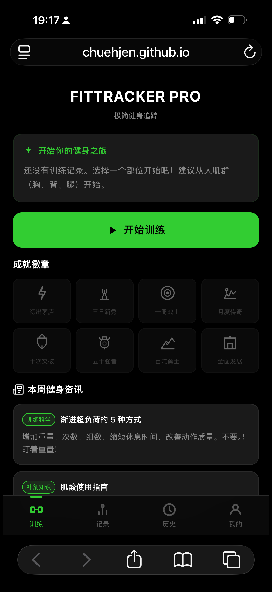
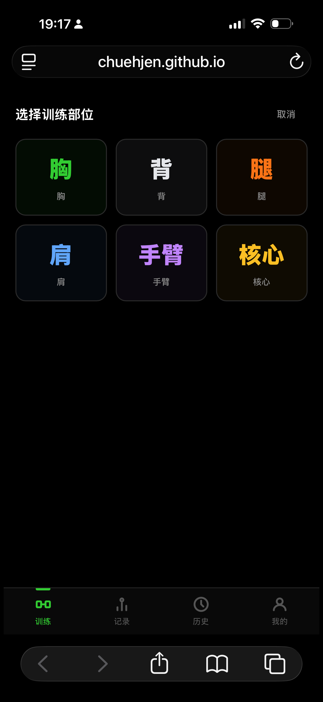
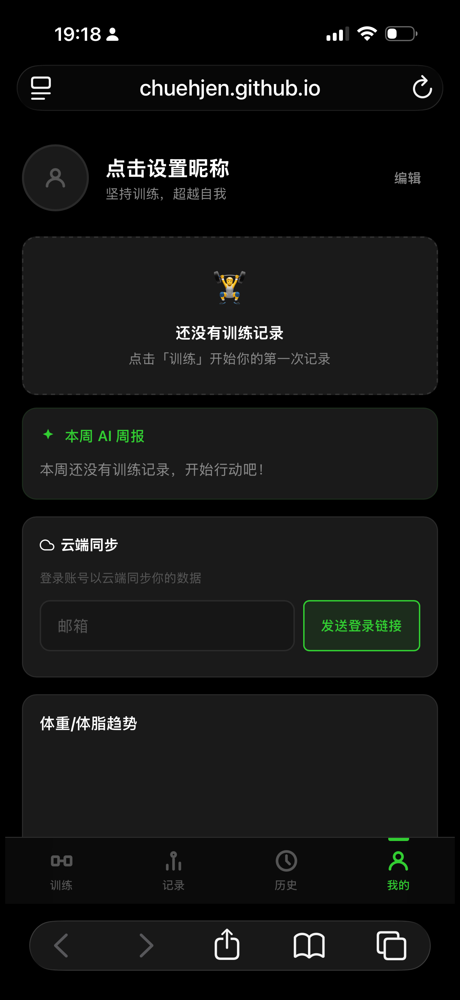

# FitTracker Pro

**A minimalist workout tracker that gets out of your way.**

→ **[Open App](https://chuehjen.github.io/fittracker/)**

---

## Screenshots

<p align="center">
  
  &nbsp;&nbsp;
  
  &nbsp;&nbsp;
  
</p>

<p align="center">
  <em>Workout home &nbsp;·&nbsp; Body part selection &nbsp;·&nbsp; Profile & cloud sync</em>
</p>

---

## What is it?

FitTracker Pro is a mobile-first PWA for tracking gym workouts. No subscriptions, no bloat — just log your sets, track your progress, and sync across devices with a Magic Link login.

---

## Features

**Workout logging**
Choose from 6 muscle groups (chest, back, legs, shoulders, arms, core), pick exercises from a built-in library of 60+ movements across machine and free weight categories, and log sets with weight and reps. Custom exercises supported.

The repo also includes a curated non-media exercise catalog generated from `hasaneyldrm/exercises-dataset` for future action-library expansion.

**Progress tracking**
Personal records (PR) are detected automatically mid-workout. History view shows past sessions by date, with volume and duration stats.

**Body weight**
Optionally log body weight from the profile page without turning the app into a full diet or health journal.

**AI workout summary**
After each session, an AI-generated summary highlights volume, PRs hit, and a motivational note.

**Cloud sync**
Sign in with Magic Link (email, no password). Data syncs across devices via Supabase — local-first with background push/pull.

**PWA**
Installable on iOS and Android as a standalone app. Works offline for core logging features.

---

## Tech Stack

| | |
|---|---|
| Frontend | Vanilla JavaScript (ES Modules) |
| Backend | Supabase (Auth + PostgreSQL) |
| Storage | IndexedDB (local) + Supabase (cloud) |
| Deploy | GitHub Pages |
| Auth | Magic Link (passwordless) |

---

## Database Schema

Three tables with Row Level Security (RLS) — users can only access their own data:

- `training_records` — workout sessions with exercises and sets (JSONB)
- `body_records` — lightweight body weight records
- `custom_exercises` — user-defined movements

All tables support soft delete and last-write-wins sync. See [`supabase-schema.sql`](./supabase-schema.sql) for the full schema.

---

## Local Development

```bash
# Serve locally (required for ES Modules)
node serve.js

# Or use any static server
npx serve .
```

Supabase credentials are in `js/sync.js`. For your own deployment, create a Supabase project and run `supabase-schema.sql` in the SQL editor, then update the URL and anon key.

---

## License

MIT

---
---

# FitTracker Pro — 极简健身追踪

**专注训练，不被功能打扰。**

→ **[打开应用](https://chuehjen.github.io/fittracker/)**

---

## 应用截图

<p align="center">
  
  &nbsp;&nbsp;
  
  &nbsp;&nbsp;
  
</p>

<p align="center">
  <em>训练首页 &nbsp;·&nbsp; 部位选择 &nbsp;·&nbsp; 我的页面与云端同步</em>
</p>

---

## 这是什么？

FitTracker Pro 是一款移动端优先的 PWA 健身追踪应用。无需订阅、无广告——记录组数、追踪进步，通过 Magic Link 登录即可跨设备同步。

---

## 功能介绍

**训练记录**
支持 6 大肌群（胸、背、腿、肩、手臂、核心），内置 60+ 动作库，涵盖器械与自由训练，按组记录重量和次数，支持自定义动作。

仓库内另有一份基于 `hasaneyldrm/exercises-dataset` 生成的非媒体精选动作数据，为后续动作库扩展做准备。

**进步追踪**
训练过程中自动识别个人记录（PR）。历史页面按日期展示过往训练，包含训练量和时长统计。

**体重记录**
可在「我的」页面轻量记录体重，不扩展成复杂饮食或健康日志。

**AI 训练总结**
每次训练结束后，AI 自动生成总结，包括训练量分析、PR 提示和激励语。

**云端同步**
通过 Magic Link 登录（邮箱，无需密码），数据经由 Supabase 跨设备同步——本地优先，后台推送拉取。

**PWA**
可在 iOS 和 Android 上安装为独立 App，核心记录功能支持离线使用。

---

## 技术栈

| | |
|---|---|
| 前端 | 原生 JavaScript（ES Modules） |
| 后端 | Supabase（Auth + PostgreSQL） |
| 存储 | IndexedDB（本地）+ Supabase（云端） |
| 部署 | GitHub Pages |
| 登录 | Magic Link（无密码） |

---

## 数据库结构

三张表，均启用行级安全策略（RLS），用户只能访问自己的数据：

- `training_records` — 训练记录，动作和组数以 JSONB 存储
- `body_records` — 轻量体重记录
- `custom_exercises` — 用户自定义动作

所有表支持软删除和最后写入胜出的同步策略，完整 Schema 见 [`supabase-schema.sql`](./supabase-schema.sql)。

---

## 本地运行

```bash
# 启动本地服务（ES Modules 需要 HTTP 服务）
node serve.js

# 或使用任意静态服务器
npx serve .
```

Supabase 配置在 `js/sync.js`。自行部署时，在 Supabase 创建项目并在 SQL 编辑器执行 `supabase-schema.sql`，然后替换 URL 和 anon key。

---

## 许可证

MIT
